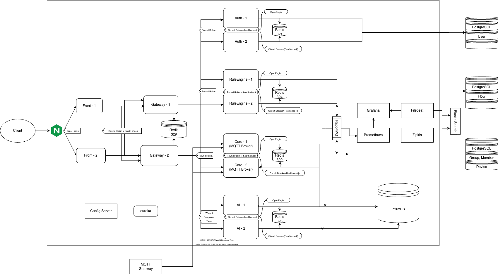
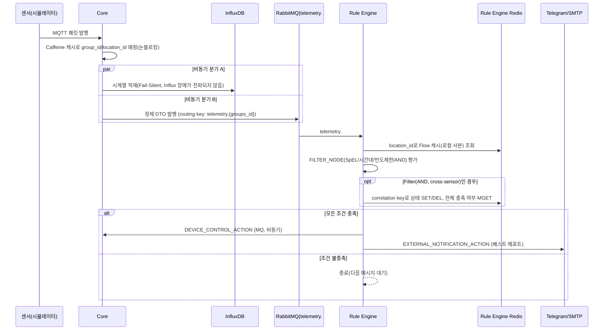
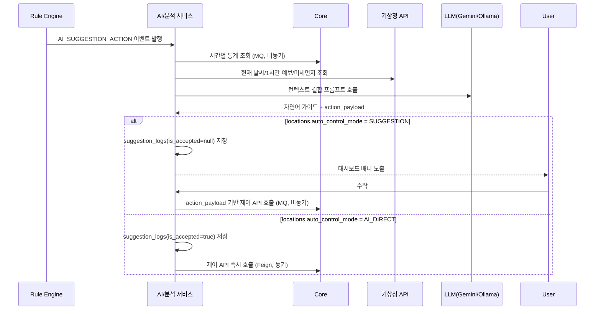
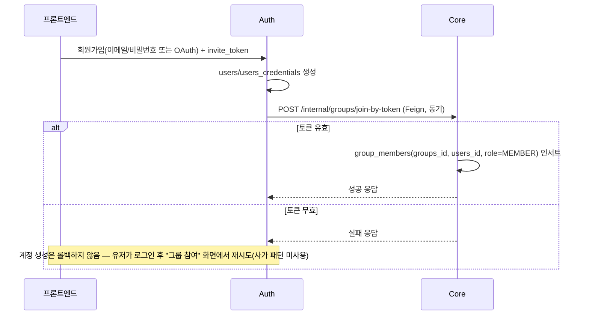
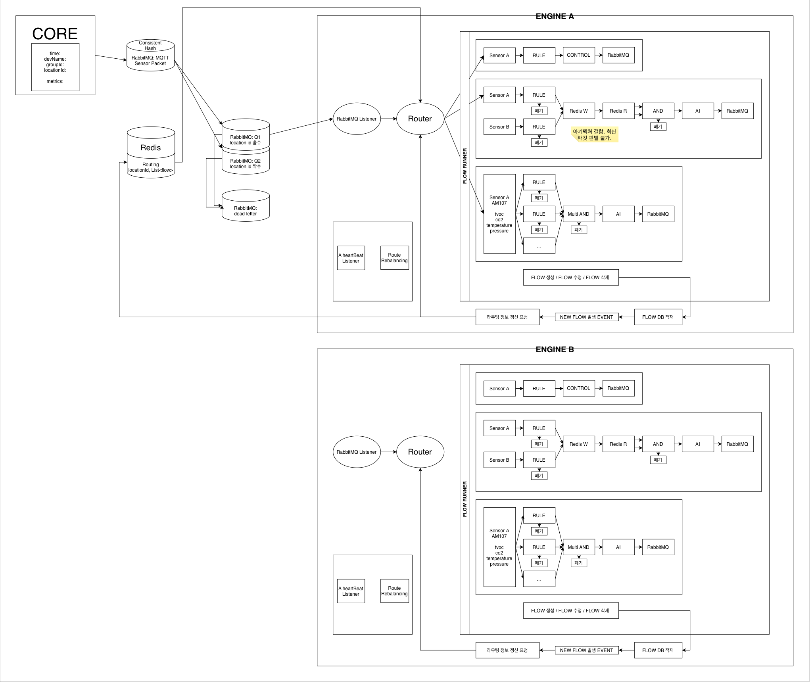
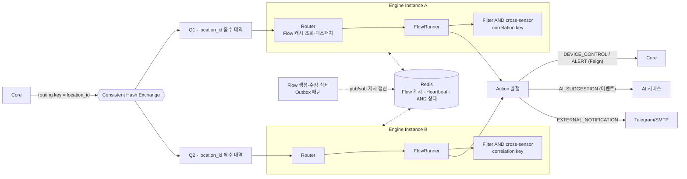

# InsightOn
### 멀티테넌트(SaaS) 스마트 오피스 지능형 IoT 관제 및 AI 자동 제어 플랫폼

실시간 IoT 관제 + 노코드 자동화 + LLM 기반 지능형 제어로, 
사람이 개입하지 않아도 오피스 공기질과 에너지가 최적 상태로 유지되는 플랫폼입니다.

 

## 📌 소개

**InsightOn**은 오피스 공간에 설치된 IoT 센서·액추에이터 데이터를 실시간으로 수집·관제하고, 규칙 기반 자동화와 AI 기반 지능형 판단을 결합해 실내 환경을 자동으로 최적화하는 멀티테넌트 SaaS 플랫폼입니다. 여러 고객사(그룹)가 하나의 플랫폼에서 완전히 격리된 환경으로 운영되며, MSA(Gateway / Auth / Core / Rule Engine / AI·분석) 구조로 설계되었습니다.
 

## 👥 팀원 소개

| 프로필 | GitHub | 이름 | 담당 파트 |
|:---:|:---|:---|:---|
|  | [@dayea11](https://github.com/dayea11) | | |
|  | [@hiadela0802](https://github.com/hiadela0802) | | |
|  | [@Jungeunsun565](https://github.com/Jungeunsun565) | | |
|  | [@naeun912](https://github.com/naeun912) | | |
|  | [@OiJs](https://github.com/OiJs) | | |
|  | [@SRIOUSS](https://github.com/SRIOUSS) | | |
|  | [@Wjdwodud2525](https://github.com/Wjdwodud2525) | | |
|  | [@wognlrla](https://github.com/wognlrla) | | |
 

## 📋 서비스 기획서

<b>펼쳐서 전체 기획서 보기</b>

 

1. 서비스 목적

 

**배경 및 문제의식**

오피스 공간의 공기질(CO2, 온도, 습도)과 공조 설비는 대부분 사람이 감각적으로 판단해 수동으로 조작하거나, 아예 관리되지 않은 채 방치됩니다.

- 실내 공기질이 나빠져도 즉시 인지하기 어렵고, 대응이 항상 늦습니다.
- 에어컨·공기청정기를 계속 켜두거나 반대로 꺼둔 채 방치해 에너지가 낭비됩니다.
- 환기를 해야 할지 공기청정기를 틀어야 할지 판단하려면 실내 상태뿐 아니라 바깥 날씨·미세먼지까지 종합적으로 봐야 하는데, 사람이 매번 확인하고 판단하기 어렵습니다.
- 여러 사업장(층/회의실 등)을 운영하는 회사는 공간마다 담당자가 따로 없어 관리 사각지대가 생깁니다.

**서비스 목표**

InsightOn은 오피스 공간에 설치된 IoT 센서·액추에이터를 실시간으로 관제하고, 규칙 기반 자동화와 LLM 기반 지능형 판단을 결합해 사람이 개입하지 않아도 실내 환경이 최적 상태로 유지되도록 만드는 멀티테넌트 SaaS 플랫폼입니다.

**타겟 고객**

여러 사무 공간(층, 회의실)을 운영하며 공기질·에너지 관리를 체계화하고 싶은 B2B 고객사(중소~중견 규모 오피스 운영 기업, 공유오피스 운영사 등).

**핵심 가치 제안**

- **실시간성**: 센서 패킷 인입부터 화면 반영까지 초저지연 처리
- **자동화의 2단계 구조**: 사람이 정한 명시적 규칙(규칙 기반 자동화)과, 상황을 스스로 해석해 선제적으로 판단하는 AI 자동 제어를 모두 제공
- **맥락 있는 판단**: 실내 데이터뿐 아니라 실시간 날씨·미세먼지까지 결합해 "왜 이 조치가 필요한지"를 자연어로 설명
- **멀티테넌트 격리**: 고객사별 데이터와 인프라가 완전히 분리되어 한 회사의 장애·트래픽 폭증이 다른 회사에 영향을 주지 않음
- **규칙 엔진 이중화**: Rule Engine은 고정 2인스턴스 active-active로 운영되어, 한 인스턴스 장애 시에도 자동화 처리가 끊기지 않음

2. 요구사항 (전체 명세)

 

>  **Should**(MVP 포함, 지연 가능) / **Could**(여유 있으면 포함). `TBD`는 임의로 확정하지 않은 값입니다.

#### 2.1 실시간 관제 (담당: CORE)

| ID | 요구사항 | 상세 설명 / 수용 기준 | 우선순위 | 의존성 |
|---|---|---|---|---|
| FR-01 | 공간별 센서 실시간 차트 | CO2/온도/습도 각각 개별 차트로 표시. 신규 패킷 수신 후 화면 반영까지 지연 시간 `TBD`(NFR-01과 연동) 이내. 차트 축은 최근 `TBD`분/시간 슬라이딩 윈도우 | Must | Core MQTT 수집 파이프라인, InfluxDB 조회 API |
| FR-02 | 대시보드 위젯 커스터마이징 | 위젯 추가/삭제/드래그 배치/크기 조정이 가능하고 새로고침 후에도 배치가 유지(영속화)되어야 함. 위젯 종류: 시계열 차트, 현재값 카드, 기기 상태, 알람 피드(최소 세트, 확장 가능) | Should | `dashboards`/`widgets` 엔티티 |
| FR-03 | 기기 제어(수동) | 대시보드에서 액추에이터 ON/OFF 및 모드 제어. 명령 전송 후 `simulator_run_logs`에 실행 주체 `USER`로 기록되고, 실제 상태 반영을 대시보드에서 확인 가능해야 함 | Must | Core 제어 API, `device_attributes.current_value_str` |

#### 2.2 인프라/기기 관리 (담당: INFRA/CORE)

| ID | 요구사항 | 상세 설명 / 수용 기준 | 우선순위 | 의존성 |
|---|---|---|---|---|
| FR-04 | 게이트웨이/기기 상태 조회 | `gateways.status`(NORMAL/FAULT), `last_heartbeat_at` 기준 목록 조회. 하트비트 임계 시간(`TBD`, 예: 5분) 초과 시 FAULT 자동 전환 | Must | 게이트웨이 헬스체크 스케줄러(ShedLock) |
| FR-05 | 신규 기기 자동 인식 | 미등록 기기의 첫 패킷 수신 시 `devices`/`device_attributes` 자동 생성, 이후 즉시 대시보드에 노출 | Should | Core Auto-Provisioning 로직 |

#### 2.3 규칙 기반 자동화 (담당: ENGINE)

> ⚠️ 아래 내용은 Rule Engine 상세 설계(파티션 라우팅·이중화·Redis 상태 관리)를 반영해 갱신되었습니다. 자세한 내용은 하단 [파트별 아키텍처 — Engine](#-파트별-아키텍처--engine-rule-engine) 참고.

| ID | 요구사항 | 상세 설명 / 수용 기준 | 우선순위 | 의존성 |
|---|---|---|---|---|
| FR-06 | 노코드 플로우 빌더 | TRIGGER_NODE 1개 → FILTER_NODE 0개 이상 → ACTION_NODE 1개 이상으로 구성되는 DAG(순환 없음, 저장 시점 검증). `flows`/`nodes`/`links`로 영속화, `status`(DRAFT/ACTIVE/INACTIVE/ARCHIVED) 토글로 활성 제어 | Must | Rule Engine 엔티티 계층 |
| FR-07 | 센서 임계치 트리거 | `SENSOR_TRIGGER` — 공간(location_id) 단위로 발화. Core가 RabbitMQ **Consistent Hash Exchange**에 `location_id`를 routing key로 발행하면, 같은 location_id는 항상 같은 고정 파티션(Q1: 홀수 대역 / Q2: 짝수 대역)으로 분리되어 각 Rule Engine 인스턴스가 자기 파티션만 소비. 인스턴스별 Redis Flow 캐시(`location_id → List<Flow>`)의 로컬 사본으로 O(1) 조회 | Must | Core→RabbitMQ 발행 파이프라인, Consistent Hash Exchange 플러그인 |
| FR-08 | 스케줄 트리거 | `SCHEDULE_TRIGGER` — cron 표현식 기반 실행(예: 출근 시간 예열). 텔레메트리 이벤트 없이도 다운스트림 실행 | Should | Rule Engine 자체 스케줄러 |
| FR-09 | 조건 필터 | `THRESHOLD_FILTER`(SpEL 조건식, `SimpleEvaluationContext`로 제한해 임의 코드 실행 차단), `TIME_WINDOW_FILTER`(시간대 제한). 다중 조건 결합은 두 패턴으로 구분: **Filter(Multi-AND)** — 한 센서가 한 패킷에 담은 여러 필드를 그 센서가 실제 전송하는 필드 개수만큼 동적으로 순차 평가(상태 저장 불필요, 같은 패킷이라 지연 도착 없음). **Filter(AND, cross-sensor)** — 서로 다른 센서(최대 3개)의 비동기 값을 correlation key(`flow_id+node_id+location_id`) 기준 Redis에 SET/DEL로 즉시 반영해 판별(값 만료는 노드 설정값 TTL, 센서 전송 주기가 비일관적이라 근거값 아님) | Must | SpEL 평가기, Redis |
| FR-10 | 반복 제어/알림 빈도 제한 | `TIMER_FILTER` — 지정 주기(`interval_seconds`)당 최초 1회만 통과. 상태는 `(node_id, location_id)` 조합별 **Redis에 `SET fired:{key} true EX <ttl> NX`로 원자적으로 관리**(다중 인스턴스 간 공유, 인메모리 아님). 조건이 깨지면(재조회 시 유효값 없음) 즉시 `DEL`로 리셋. Rule Engine은 고정 2인스턴스(active-active)로 상시 운영되며, 이 상태 공유가 그 전제 | Should | Redis(공유 상태 저장소) |
| FR-11 | 규칙 기반 기기 제어 | `DEVICE_CONTROL_ACTION` — AI 개입 없이 Core 제어 API 직접 호출(Feign, 동기). `simulator_run_logs.executed_by_type='RULE_ENGINE'`로 기록 | Must | Core 제어 API |
| FR-12 | 즉시 알림 | `ALERT_ACTION` — LLM 없이 즉시 `dashboard_alerts` 생성 | Must | AI 서비스 알람 생성 API |
| FR-13 | AI 위임 | `AI_SUGGESTION_ACTION` — 실행 컨텍스트를 AI 서비스로 이벤트 발행(비동기) | Must | AI 서비스 이벤트 리스너 |
| FR-14 | 외부 채널 알림 | `EXTERNAL_NOTIFICATION_ACTION` — Telegram/이메일. 발송은 베스트 에포트(실패 시 재시도/영구 기록 없음, 확정 사항) | Should | Telegram Bot API / SMTP 연동 |

#### 2.4 AI 지능형 제어 (담당: CORE, AI, API)

| ID | 요구사항 | 상세 설명 / 수용 기준 | 우선순위 | 의존성 |
|---|---|---|---|---|
| FR-15 | 공간별 운영 모드 선택 | `locations.auto_control_mode` = `SUGGESTION` \| `AI_DIRECT` 토글 | Must | Core `locations` 스키마 보정 |
| FR-16 | 상황 인지형 제안 생성 | Core 시간별 통계 + 기상청 현재/1시간 예보/미세먼지를 결합해 LLM이 인과관계 있는 자연어 가이드 생성 | Must | 프롬프트 조립기, 기상청 캐시 |
| FR-17 | SUGGESTION 모드 수락 흐름 | 제안 생성 시 `is_accepted=null` 저장 + 대시보드 배너 노출 → 유저 수락 클릭 시 `action_payload` 기반 Core 제어 API 호출 및 `is_accepted=true` 갱신 | Must | `suggestion_logs` |
| FR-18 | AI_DIRECT 모드 즉시 집행 | 생성과 동시에 `is_accepted=true` 자동 적재 + 유저 확인 없이 즉시 Core 제어 API 호출 | Must | 동일 |

#### 2.5 알림 (담당: CORE, ENGINE)

| ID | 요구사항 | 상세 설명 / 수용 기준 | 우선순위 | 의존성 |
|---|---|---|---|---|
| FR-19 | 대시보드 실시간 알람 표시 | 신규 `dashboard_alerts` 생성 시 대시보드에 즉시 반영 | Must | **전송 방식(WebSocket/SSE/폴링) 미확정 — 팀 확인 필요** |
| FR-20 | Telegram/이메일 알림 | FR-14와 동일 채널 — 알람 발생 시 외부 채널로도 발송 | Could | FR-14 |

#### 2.6 리포트 (담당: AI — README 원본의 "CORE" 표기는 오탈자로 판단, `smart-office-iot-architecture-spec.md` 4장 기준 정정)

| ID | 요구사항 | 상세 설명 / 수용 기준 | 우선순위 | 의존성 |
|---|---|---|---|---|
| FR-21 | 정각 통계 집계 | 매시 정각 InfluxDB 원시 데이터로 평균/최고/최저 산출 + 액추에이터별 가동 분(JSONB) 산출. 데이터 없는 location은 행 미생성(의도된 동작) | Must | `hourly_telemetry_stats` 데이터 계층 |
| FR-22 | 주간/월간 리포트 | `hourly_telemetry_stats` 결산 데이터를 컨텍스트로 LLM이 마크다운 리포트 본문 생성 | Should | `reports` 데이터 계층 |

#### 2.7 이력/감사 (담당: CORE)

| ID | 요구사항 | 상세 설명 / 수용 기준 | 우선순위 | 의존성 |
|---|---|---|---|---|
| FR-23 | 실행 주체별 제어 이력 조회 | `executed_by_type`(`USER`/`AI_SYSTEM`/`RULE_ENGINE`) 기준 필터 조회 | Should | `simulator_run_logs` 스키마 보정 |

#### 2.8 조직/계정 관리 (담당: AUTH)

| ID | 요구사항 | 상세 설명 / 수용 기준 | 우선순위 | 의존성 |
| --- | --- | --- | --- | --- |
| FR-24 | 회원가입 — 이메일 인증 | 가입 전 이메일로 인증코드(숫자) 발송·확인 후 인증토큰(UUID) 발급. 가입 시 이메일 인증 필수 | Must | 메일 발송, Redis |
| FR-25 | 회원가입 — 이메일 중복 확인 | 가입 가능한 이메일인지 사전 확인 | Must | `users` |
| FR-26 | 회원가입 — 일반 회원가입 | 이메일·비밀번호·이름·전화번호로 가입, 인증토큰 필수(미인증 시 차단), 비밀번호 BCrypt 해시 | Must | `users`, `user_credentials` |
| FR-27 | 회원가입 — 소셜 회원가입 | Google·GitHub 계정으로 가입 겸 로그인, OAuth는 이메일 인증 예외 | Must | `oauth` |
| FR-28 | 로그인 — 일반 로그인 | 이메일·비밀번호 검증(BCrypt) 후 토큰 발급 | Must | `users`, `user_credentials` |
| FR-29 | 로그인 — 소셜 로그인 | Google·GitHub OAuth 로그인 | Must | `oauth` |
| FR-30 | 로그인 — 로그인 잠금 | 5회 연속 실패 시 5분간 계정 잠금 (`423 ACCOUNT_LOCKED`) | Must | Redis |
| FR-31 | 로그인 — 상태별 로그인 제어 | 휴면·차단·탈퇴 계정 로그인 차단 및 분기 처리 (`403` / `PENDING_RESTORE`) | Must | `users` |
| FR-32 | 토큰 — Access Token 발급 | 로그인 시 발급, 15분 만료, 매 요청 인증에 사용(Authorization), 비대칭키(RS256) 서명 | Must | — |
| FR-33 | 토큰 — Refresh Token 발급 | HttpOnly 쿠키로 발급, 14일 만료, Redis 저장, body 미노출 | Must | Redis |
| FR-34 | 토큰 — 토큰 재발급 | Access 만료 시 Refresh로 자동 재발급(로테이션), 끊김 없는 로그인 유지 | Must | Redis |
| FR-35 | 토큰 — 로그아웃 | 토큰 무효화(블랙리스트) 및 쿠키 삭제 | Must | Redis |
| FR-36 | 계정 관리 — 아이디 찾기 | 이름·전화번호로 이메일을 마스킹해 안내 (OAuth 불필요) | Must | `users` |
| FR-37 | 계정 관리 — 비밀번호 재설정 | 이메일로 일회성·만료 재설정 URL 발송 후 변경 (OAuth 전용 계정 제외) | Must | 메일 발송 |
| FR-38 | 계정 관리 — 탈퇴 | 물리 삭제 대신 상태만 WITHDRAW로 변경(이력 보존), 10일 이내 복구 가능 | Must | `users` |
| FR-39 | 계정 관리 — 탈퇴 복구 | 탈퇴 10일 이내 재로그인 시 복구 흐름, 초과 시 `410`, 이메일 선점 시 `409` | Must | `users` |
| FR-40 | 계정 관리 — 휴면 해제 | 휴면 계정 이메일 재인증 후 ACTIVE 복귀 | Must | 메일 발송 |
| FR-41 | 내 정보 — 내 정보 조회 | 이메일·이름·전화번호·OAuth 연동 여부 조회 | Must | `users`, `oauth` |
| FR-42 | 내 정보 — 내 정보 수정 | 이름·전화번호 변경 (이메일 변경 불가) | Must | `users` |
| FR-43 | 내 정보 — 비밀번호 변경 | 현재 비밀번호 확인 후 변경 (OAuth 전용 계정 불가) | Must | `user_credentials` |
| FR-44 | 내 정보 — 소셜 계정 연동/해제 | 소셜 계정 추가 연동 및 해제 (마지막 수단 해제 불가) | Must | `oauth` |
| FR-45 | 내 정보 — 권한·연동 조회 | 내 권한 목록, 연동된 소셜 계정 목록 조회 | Must | `user_roles`, `oauth` |
| FR-46 | 관리자 — 회원 조회 | 회원 목록(검색·페이징)·상세(그룹 포함) 조회 (ADMIN 전용) | Must | `users`, 권한 모델 |
| FR-47 | 관리자 — 회원 상태/권한 관리 | 회원 상태·권한 변경, 회원 삭제 (ADMIN 전용) | Must | 권한 모델 |
| FR-49 | 인프라/공통 — 게이트웨이 인증 | 모든 요청이 Gateway에서 토큰 검증 후 서비스로 전달, 유레카로 위치 탐색 | Must | Gateway, Eureka |
| FR-50 | 인프라/공통 — 내부 API 제공 | 타 서비스(Core)에 회원 정보 제공 (OpenFeign, 내부 통신 전용) | Must | OpenFeign |
| FR-51 | 인프라/공통 — 휴면 전환 배치 | 스케줄러로 정기 휴면 전환 및 soft 삭제 90일 후 하드 삭제 (Redis 락으로 이중 실행 방지) | Must | 스케줄러, Redis |

#### 2.9 비기능 요구사항

| ID | 구분 | 요구사항 | 수용 기준 / 측정 방법 | 우선순위 |
|---|---|---|---|---|
| NFR-01 | 실시간성 | 패킷 수신~대시보드 반영 지연 | 목표 지연 시간 `TBD`(예: p95 2초 이내 제안, 팀 확인 필요) — 수집 스레드는 논블로킹 즉시 반환, 저장/전파는 비동기 분리 | Must |
| NFR-02 | 장애 격리 | InfluxDB 장애가 실시간 수집을 막지 않음 | Fail-Silent 구조 — Influx 쓰기 실패가 MQTT 리스너/RabbitMQ 발행 경로에 예외 전파되지 않음을 통합 테스트로 검증 | Must |
| NFR-03 | 멀티테넌시 | 그룹 간 데이터 물리적 격리 | 서비스별 독립 DB, 그룹 A의 쿼리가 그룹 B 데이터에 도달 불가함을 테스트로 검증 | Must |
| NFR-04 | 확장성 | 신규 센서/액추에이터 종류 추가 시 스키마 변경 불필요 | JSONB 컬럼 사용, 신규 종류 추가가 배포 없이 가능한지 확인 | Should |
| NFR-05 | 확장성 | 멀티 인스턴스 환경에서 배치 중복 실행 방지 | 정각 통계/주간·월간 리포트/기상청 캐시 갱신 배치에 ShedLock 적용, 2개 이상 인스턴스 동시 기동 시 1회만 실행되는지 검증 | Must |
| NFR-06 | 비용 효율 | LLM 호출은 이상 상황 발생 시에만 트리거 | 정기 배치성 LLM 호출 없음(리포트 배치 제외) | Should |
| NFR-07 | 성능 | 반복 조회 매핑 정보 캐싱 | Core `group_id`/`location_id`, Rule Engine `locations_id→flows` 매핑에 인메모리 캐시(Caffeine 등) 적용 | Should |
| NFR-08 | 보안 | 유출된 초대 토큰 즉시 무효화 | 재발급 즉시 이전 토큰으로 가입 시도 시 실패 응답 확인 | Must |
| NFR-09 | 데이터 무결성 | 동일 물리 DB 내 실제 FK 제약 | 각 서비스 ERD 갭 표 반영한 DDL에 FK 제약이 실제로 걸려 있는지 확인 | Must |
| NFR-10 | 오버 엔지니어링 회피 | 불필요한 이력 저장/과도한 트랜잭션 보장 지양 | 게이트웨이/기기 상태 이력 테이블 미생성, 알림 발송 로그 미보관 등 확정 사항 유지 | Should |
| NFR-11 | Rule Engine 이중화 | 고정 2인스턴스 active-active, 하나가 다운되어도 나머지가 전체 트래픽 흡수 | Redis TTL 기반 Heartbeat로 상대 인스턴스 생존 감지(초 단위), 소실 시 상대방 파티션 큐 즉시 흡수, 복구 시 연속 5회(약 5초) 안정 확인 후 반납(flapping 방지) | Must |
| NFR-12 | Rule Engine 확장성 범위 | 현재 트래픽 규모에서 3개 이상 인스턴스로 동적 확장 미지원 | 의도적 스코프 제한, 트래픽 실측 후 재검토 | Should |

#### 2.10 미확정 항목 (임의 결정 금지 — 팀 논의 필요)

| 항목 | 관련 요구사항 | 비고 |
|---|---|---|
| 실시간 알람 푸시 방식 (WebSocket/SSE/폴링) | FR-19 | Issue 05 |
| 실시간성 목표 지연 시간(SLA) | NFR-01 | 구체적 수치 미정 |
| 게이트웨이 하트비트 임계 시간 | FR-04 | 구체적 수치 미정 |
| OAuth 제공자 목록 | FR-26 | 구체적 목록 미정 |
| 역할별 접근 권한 매트릭스 | FR-25 | 화면/API 단위 매핑표 별도 필요 |
| Filter(AND, cross-sensor)의 TTL 근거값 | FR-09 | 센서 전송 주기가 비일관적으로 확인되어 현재는 노드 설정값(임시값)으로 대체. 실측 데이터 확보 후 재산정 |
| Rule Engine의 센서 필드 스키마 참조 방식 | FR-09(Filter Multi-AND) | Core의 devices/device_attributes를 API 호출로 참조할지, 이벤트 기반 캐시로 참조할지 미확정 |

3. 제공 기능

 

- **실시간 관제 대시보드**: 공간별 커스텀 위젯 대시보드, 실시간 시계열 차트
- **인프라 및 기기 관리**: 게이트웨이/기기 등록·상태 조회, 신규 기기 자동 인식
- **액추에이터 원격 제어**: 대시보드에서 수동 ON/OFF 및 모드 제어
- **노코드 자동화(규칙 엔진)**: 트리거 → 조건 필터 → 액션 DAG 플로우 빌더 (센서 임계치/스케줄 트리거, 조건식/시간대/빈도 제한 필터, 같은 센서 다중필드 AND·서로 다른 센서 간 AND 두 종류 지원, 기기 제어·알림·AI 요청 액션), **Rule Engine 고정 2인스턴스 이중화**
- **AI 지능형 제어**: 공간별 운영 모드 선택, 날씨·미세먼지 결합 상황 인지형 제안, 인과관계가 담긴 자연어 가이드
- **알림**: 대시보드 실시간 알람 피드, Telegram/이메일 외부 알림
- **리포트 및 분석**: 시간별 통계 집계, 주간/월간 AI 정밀 진단 리포트
- **제어 이력 및 감사**: 실행 주체별(유저/AI/규칙엔진) 제어 이력 조회
- **조직 및 계정 관리**: 초대 토큰 온보딩, 역할 기반 권한, 이메일/소셜 로그인

 

## 🏗️ 시스템 아키텍처

> 1) 컨테이너 다이어그램(프로토콜/동기·비동기 명시) + (2) 핵심 흐름 3개의 시퀀스 다이어그램 + (3) 데이터 저장 전략

### 3.1 컨테이너 다이어그램

MSA(5개 마이크로서비스) 구조로, 서비스 간 물리 DB는 완전히 분리되고 논리 키 매핑으로 연동됩니다. 화살표에는 프로토콜과 동기(●)/비동기(○) 여부 표기

| 컴포넌트 | 책임 | 데이터 저장소 |
|---|---|---|
| Gateway | 단일 진입점, 라우팅/부하분산 | - |
| Auth | 인증/인가 | 독립 PostgreSQL |
| Core | MQTT 수집·가공, 인프라 장부, 대시보드 API, 액추에이터 제어 | Core PostgreSQL + InfluxDB |
| Rule Engine | 워크플로우 저장, 실시간 SpEL 조건 평가, **고정 2인스턴스 active-active 이중화** | 독립 PostgreSQL + Redis |
| AI/분석 | 정각 통계 결산, 실시간 제어 제안, LLM 리포트 | 독립 PostgreSQL |

**연동 원칙**: 서비스 간 물리 DB는 완전히 분리(Database-per-Service)되며, 물리 FK 대신 애플리케이션 레이어의 논리 키 매핑으로 연동한다. 동일 서비스 내부(같은 물리 DB) 테이블 간에는 실제 FK 제약을 건다. 서비스 간 동기 호출은 OpenFeign, 비동기 전파는 RabbitMQ만 사용한다.

### 3.2 핵심 흐름 ① — 실시간 센서 수집 → 규칙 기반 자동화

### 3.3 핵심 흐름 ② — AI 제안 / AI 직접 제어

### 3.4 핵심 흐름 ③ — 초대 토큰 온보딩 (Auth ↔ Core 크로스 서비스)

### 3.5 데이터 저장 전략

| 저장소 | 대상 | 이유 |
|---|---|---|
| PostgreSQL (서비스별 독립) | 마스터 데이터, 설정, 로그성 데이터(임계 이력 아님) | 트랜잭션/정합성 필요, Database-per-Service로 장애·트래픽 격리 |
| InfluxDB | 센서 원시 시계열, 액추에이터 상태 시계열 | 고빈도 쓰기·시간 범위 쿼리에 특화, RDB에 적재 시 트래픽 폭증 시 병목 |
| Caffeine(인메모리 캐시) | `group_id`/`location_id` 매핑, Rule Engine flow 인덱스 | 반복 조회 병목 제거, 서비스 재시작 시 재구성되는 휘발성 캐시로 충분 |
| Rule Engine Redis | Flow 캐시(`location_id→List<Flow>`), 인스턴스 Heartbeat, Filter(AND, cross-sensor) 상태 | 다중 인스턴스 간 공유가 필요한 상태이므로 Caffeine이 아닌 공유 저장소 필요 |
| ShedLock | 정각 통계 배치, 주간/월간 리포트 배치, 기상청 캐시 갱신 배치 | 멀티 인스턴스(Eureka) 환경에서 동일 배치 중복 실행 방지 |

 

## 🔧 파트별 아키텍처 — Engine (Rule Engine)

<b>Engine(아키텍처 · 요구사항 명세서 · 기능 테이블)</b>

 

Engine 아키텍처

 
    

Rule Engine은 **고정 2인스턴스(A/B) active-active**로 운영되며, 파티션 라우팅은 애플리케이션 코드가 아니라 **RabbitMQ Consistent Hash Exchange**가 담당한다. 같은 `location_id`는 항상 같은 인스턴스로 가므로, 서로 다른 센서 간 AND 판별에 필요한 상태를 별도의 분산 락 없이 다룰 수 있다.

**핵심 설계 결정**

| 항목 | 결정 | 사유 |
|---|---|---|
| 파티션 계산 | RabbitMQ Consistent Hash Exchange (routing key = location_id) | 애플리케이션 레벨 해시 계산·Router 컴포넌트 불필요, Core-Engine 결합 최소화 |
| 인스턴스 수 | 고정 2대, active-active | 현재 트래픽 규모에서 동적 확장 불필요(NFR-12), 평시 각 인스턴스 부하 50% 미만 전제 |
| 장애 감지 | Redis TTL 기반 Heartbeat (초 단위) | Eureka 기본 감지 주기(최대 90초)는 실시간 처리에 부적합, 전역 설정 변경 없이 Engine 자체 보완 |
| 장애 시 동작 | 생존 인스턴스가 상대방 파티션 큐 즉시 추가 구독 | RabbitMQ 큐는 소비자가 없어도 메시지를 보존하므로 흡수만으로 복구 가능 |
| 복구 시 동작 | 연속 5회(약 5초) 안정 확인 후 반납 | Flapping(반복 흡수/반납) 방지 |
| Filter(같은 패킷 다중 필드) | 상태 저장 없음, 동기 순차 평가 | 같은 패킷·같은 location_id로 도착해 지연/누락 시나리오가 구조적으로 없음 |
| Filter(서로 다른 센서 간 AND) | Redis SET/DEL 상시 반영 (TRUE/FALSE 모두) | 비동기 도착 값을 정합성 있게 판별. 트래픽 부하 리스크 있어 구현 시점 대안(로컬메모리+배치백업) 평가 예정 |
| Flow 캐시 동기화 | Outbox 패턴 (DB 트랜잭션 + 이벤트 발행 분리) | DB 커밋과 캐시 갱신 이벤트 발행 사이의 정합성을 분산 트랜잭션 없이 보장 |

Engine 요구사항 명세서

 

#### 기능 요구사항

| ID | 요구사항 | 설명 | 우선순위 |
|---|---|---|---|
| RE-FR-01 | Flow CRUD | Flow 생성/조회/수정/삭제, 상태(DRAFT/ACTIVE/INACTIVE/ARCHIVED) 관리 | 상 |
| RE-FR-02 | Node/Link DAG 저장 | TRIGGER_NODE/FILTER_NODE/ACTION_NODE로 구성된 DAG, 저장 시점 순환 검증 | 상 |
| RE-FR-03 | SpEL 조건 평가 | `SimpleEvaluationContext`로 제한해 임의 코드 실행(RCE) 차단 | 상 |
| RE-FR-04 | Filter(Multi-AND) | 같은 패킷 다중 필드, 센서가 전송하는 필드 개수만큼 동적 규칙 구성, 상태 저장 불필요 | 상 |
| RE-FR-05 | Filter(AND, cross-sensor) | 서로 다른 센서(최대 3개) 비동기 값 판별, correlation key 기반 Redis 상태 | 상 |
| RE-FR-06 | Action 발행 | DEVICE_CONTROL/ALERT(Feign 동기), AI_SUGGESTION(이벤트), EXTERNAL_NOTIFICATION(베스트에포트) | 상 |
| RE-FR-07 | 조건 미충족 폐기 | false 판정은 별도 저장 없이 폐기 (원본은 Core가 InfluxDB에 별도 저장) | 상 |
| RE-FR-08 | 파티션 라우팅 | Consistent Hash Exchange로 location_id 기준 Q1/Q2 분배 | 상 |
| RE-FR-09 | Flow-센서 매핑 디스패치 | location_id로 Redis Flow 캐시 조회, devName 일치 Flow 실행 | 상 |
| RE-FR-10 | Flow 캐시 동기화 | Outbox 패턴으로 각 인스턴스 로컬 캐시 atomic swap | 상 |
| RE-FR-11 | 인스턴스 장애 감지 | Redis TTL Heartbeat 상호 폴링 | 상 |
| RE-FR-12 | 장애 시 큐 흡수/복구 | 생존 인스턴스가 상대 파티션 흡수, 복구 시 debounce 후 반납 | 상 |
| RE-FR-13 | 반복 알림 제한(TIMER_FILTER) | `SET fired:{key} true EX <ttl> NX`로 원자적 중복 발동 방지, 조건 재확인 시 리셋 | 중 |
| RE-FR-14 | DLQ 관측 | 메시지 TTL 초과 시 DLQ 적재, 자동 장애판단 아닌 관측 전용 | 중 |

#### 비기능 요구사항

| ID | 분류 | 요구사항 | 비고 |
|---|---|---|---|
| RE-NFR-01 | 실시간성 | 평시 이벤트 처리는 로컬 메모리 우선 | latency 목표치 벤치마크 필요 |
| RE-NFR-02 | 가용성 | 배포 시 트래픽 손실 없는 인스턴스 교체 | graceful shutdown 시 상태 flush |
| RE-NFR-03 | 이중화 | 고정 2인스턴스 active-active | 평시 부하 50% 미만 전제 (미검증) |
| RE-NFR-04 | 확장성 범위 | 3개 이상 인스턴스 동적 확장 미지원 | 의도적 스코프 제한 |
| RE-NFR-05 | 보안 | SpEL RCE 차단 | 필수 |
| RE-NFR-06 | 손실 허용 범위 | Filter(AND, cross-sensor)는 Redis 상시 반영으로 손실 없음 | Redis 장애 시 판정 지연 리스크, 대안 평가 예정 |
| RE-NFR-07 | 라우팅 전략 예외 | 전체 MSA는 Eureka+라운드로빈, Engine만 파티션 키 라우팅 | 상태 기반 스트림 처리 특성상 예외 |
| RE-NFR-08 | 장애 감지 속도 | Eureka 기본 주기 대신 Redis Heartbeat 병행 | 전역 설정 변경 없음 |
| RE-NFR-09 | Flapping 방지 | 복구 반납 전 연속 5회 안정 확인 | 제안 기본값, 조정 가능 |

Engine 기능 테이블

 

| 기능ID | 기능명 | 입력 | 처리 | 출력 | 관련 컴포넌트 |
|---|---|---|---|---|---|
| RE-F-01 | Flow 저장 | 사용자 정의 Flow | DAG 검증 → DB 트랜잭션(flows+outbox) 커밋 | 저장 결과, outbox 이벤트 | API, DB, Outbox |
| RE-F-02 | Flow 캐시 반영 | outbox 이벤트 | Poller 조회 → Redis pub/sub 발행 → 인스턴스 구독 | 로컬 캐시 atomic swap | Outbox Poller, Redis |
| RE-F-03 | 이벤트 파티셔닝 | 센서 이벤트, location_id | Consistent Hash Exchange 해시 링 매핑 | Q1/Q2 물리 분리 | Core, RabbitMQ |
| RE-F-04 | Flow-센서 매핑 디스패치 | location_id, devName | Redis 캐시 조회, devName 일치 Flow 탐색 | 실행 대상 Flow 목록 | Router |
| RE-F-05 | Filter(leaf) 판별 | 필드값, SpEL 조건 | SpEL 평가 | true/false | FILTER_NODE |
| RE-F-06 | Filter(Multi-AND) 판별 | 한 패킷의 여러 필드값 | 순차 SpEL 평가, 상태 없음 | true/false | FILTER_NODE |
| RE-F-07 | Filter(AND, cross-sensor) 판별 | 비동기 도착 값, correlation key | Redis SET/DEL/MGET | true/false | FILTER_NODE, Redis |
| RE-F-08 | 반복 알림 제한 | 판정 결과, node_id+location_id | Redis fired 플래그 NX/DEL | 발동 여부 | Redis |
| RE-F-09 | Action 발행 | 최종 판정 결과 | 목적지별 메시지/호출 구성 | Feign 호출/이벤트/외부발송 | ACTION_NODE |
| RE-F-10 | 폐기 처리 | false 판정 신호 | 별도 저장 없이 종료 | 없음 | FILTER_NODE |
| RE-F-11 | 인스턴스 장애 감지/흡수 | Redis heartbeat 키 | TTL 만료 감지 → 파티션 큐 추가 구독 | 생존 인스턴스 전체 처리 | Redis, RabbitMQ |

 

## 🛠️ 기술 스택

`Java` · `Spring Boot` · `Spring AI` · `Thymeleaf` · `PostgreSQL` · `InfluxDB` · `RabbitMQ` · `ChirpStack (LoRaWAN)` · `MQTT` · `Redis`
