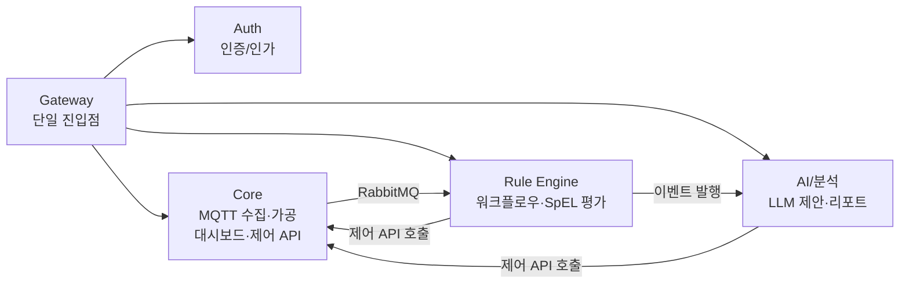

# InsightOn

### 멀티테넌트(SaaS) 스마트 오피스 지능형 IoT 관제 및 AI 자동 제어 플랫폼

실시간 IoT 관제 + 노코드 자동화 + LLM 기반 지능형 제어로, 
사람이 개입하지 않아도 오피스 공기질과 에너지가 최적 상태로 유지되는 플랫폼입니다.

 

## 📌 소개

**InsightOn**은 오피스 공간에 설치된 IoT 센서·액추에이터 데이터를 실시간으로 수집·관제하고, 규칙 기반 자동화와 AI 기반 지능형 판단을 결합해 실내 환경을 자동으로 최적화하는 멀티테넌트 SaaS 플랫폼입니다. 여러 고객사(그룹)가 하나의 플랫폼에서 완전히 격리된 환경으로 운영되며, MSA(Gateway / Auth / Core / Rule Engine / AI·분석) 구조로 설계되었습니다.

 

## 👥 팀원 소개

| 프로필 | GitHub | 이름 | 담당 파트 |
|:---:|:---|:---|:---|
|  | [@dayea11](https://github.com/dayea11) | | |
|  | [@hiadela0802](https://github.com/hiadela0802) | | |
|  | [@Jungeunsun565](https://github.com/Jungeunsun565) | | |
|  | [@naeun912](https://github.com/naeun912) | | |
|  | [@OiJs](https://github.com/OiJs) | | |
|  | [@SRIOUSS](https://github.com/SRIOUSS) | | |
|  | [@Wjdwodud2525](https://github.com/Wjdwodud2525) | | |
|  | [@wognlrla](https://github.com/wognlrla) | | |

 

## 📋 서비스 기획서

<b>펼쳐서 전체 기획서 보기</b>

 

1. 서비스 목적

 

**배경 및 문제의식**

오피스 공간의 공기질(CO2, 온도, 습도)과 공조 설비는 대부분 사람이 감각적으로 판단해 수동으로 조작하거나, 아예 관리되지 않은 채 방치됩니다.

- 실내 공기질이 나빠져도 즉시 인지하기 어렵고, 대응이 항상 늦습니다.
- 에어컨·공기청정기를 계속 켜두거나 반대로 꺼둔 채 방치해 에너지가 낭비됩니다.
- 환기를 해야 할지 공기청정기를 틀어야 할지 판단하려면 실내 상태뿐 아니라 바깥 날씨·미세먼지까지 종합적으로 봐야 하는데, 사람이 매번 확인하고 판단하기 어렵습니다.
- 여러 사업장(층/회의실 등)을 운영하는 회사는 공간마다 담당자가 따로 없어 관리 사각지대가 생깁니다.

**서비스 목표**

InsightOn은 오피스 공간에 설치된 IoT 센서·액추에이터를 실시간으로 관제하고, 규칙 기반 자동화와 LLM 기반 지능형 판단을 결합해 사람이 개입하지 않아도 실내 환경이 최적 상태로 유지되도록 만드는 멀티테넌트 SaaS 플랫폼입니다.

**타겟 고객**

여러 사무 공간(층, 회의실, 지점 등)을 운영하며 공기질·에너지 관리를 체계화하고 싶은 B2B 고객사(중소~중견 규모 오피스 운영 기업, 공유오피스 운영사 등).

**핵심 가치 제안**

- **실시간성**: 센서 패킷 인입부터 화면 반영까지 초저지연 처리
- **자동화의 2단계 구조**: 사람이 정한 명시적 규칙(규칙 기반 자동화)과, 상황을 스스로 해석해 선제적으로 판단하는 AI 자동 제어를 모두 제공
- **맥락 있는 판단**: 실내 데이터뿐 아니라 실시간 날씨·미세먼지까지 결합해 "왜 이 조치가 필요한지"를 자연어로 설명
- **멀티테넌트 격리**: 고객사별 데이터와 인프라가 완전히 분리되어 한 회사의 장애·트래픽 폭증이 다른 회사에 영향을 주지 않음

2. 요구사항

 

**기능 요구사항**

| 영역 | 요구사항 |
|---|---|
| 실시간 관제 | 공간별 센서 데이터(CO2, 온도, 습도)를 실시간 차트로 확인 |
| 실시간 관제 | 대시보드를 위젯 단위로 자유롭게 구성(추가/배치/크기 조정) |
| 기기 제어 | 액추에이터(에어컨, 공기청정기, 환기팬 등) 대시보드 수동 원격 제어 |
| 인프라 관리 | 게이트웨이·기기의 등록 현황과 정상/장애 상태 조회 |
| 신규 기기 인식 | 미등록 기기의 패킷이 최초 수신되면 자동으로 장비 등록 |
| 규칙 자동화 | 코드 작성 없이 트리거·조건·액션을 조합한 자동화 규칙 생성 |
| 규칙 자동화 | 센서 임계치 기반뿐 아니라 특정 시각(cron) 기반 실행 지원 |
| 규칙 자동화 | 동일 조건 반복 발생 시 알림·제어 과다 반복 방지(빈도 제한) |
| AI 제어 | 공간별 "AI 제안만 받기" / "AI가 직접 제어하기" 모드 선택 |
| AI 제어 | 실내 센서 추이 + 실시간 외부 날씨·미세먼지 결합 제어 제안 |
| AI 제어 | "제안 받기" 모드에서 수락 시 즉시 실제 기기 제어로 연결 |
| 알림 | 임계치 초과 등 이상 상황 대시보드 즉시 알림 표시 |
| 알림 | Telegram/이메일로도 알림 수신 |
| 리포트 | 매시간 센서 통계(평균/최고/최저) 및 기기별 가동 시간 자동 집계 |
| 리포트 | 주간/월간 에너지 효율·쾌적도 진단 리포트 자동 생성 |
| 이력/감사 | 모든 기기 제어 이력을 실행 주체(유저/AI/규칙엔진)별로 조회 |
| 조직 관리 | 초대 토큰 하나로 멤버 셀프 가입 |
| 조직 관리 | 역할(소유자/관리자/멤버)별 접근 권한 차등 |
| 계정 | 이메일/비밀번호 또는 소셜 로그인(OAuth) 지원 |

**비기능 요구사항**

| 구분 | 요구사항 |
|---|---|
| 실시간성 | 수집 스레드는 논블로킹 즉시 반환, 저장/전파는 비동기 분리 |
| 장애 격리 | 시계열 저장소(InfluxDB) 장애가 실시간 수집 전체를 막지 않음(Fail-Silent) |
| 멀티테넌시 | 고객사(그룹) 간 데이터 물리적 격리, 서비스별 독립 DB |
| 확장성 | 새 센서 항목/액추에이터 종류 추가 시에도 스키마 변경 없이 수용(JSONB) |
| 확장성 | 대형 고객사 트래픽 증가 시 다른 고객사 영향 없이 별도 자원 배정 가능 |
| 비용 효율 | LLM 호출은 정기 배치가 아닌 이상 상황 발생 시에만 트리거 |
| 성능 | 반복 조회되는 매핑 정보는 인메모리 캐시로 DB 조회 병목 방지 |
| 보안 | 유출된 초대 토큰은 즉시 재발급(무효화) 가능 |
| 데이터 무결성 | 동일 물리 DB 내 테이블 간 참조 무결성을 실제 제약조건으로 보장 |
| 오버 엔지니어링 회피 | 실제 운영 필요성이 확인되기 전까지 불필요한 이력 저장·과도한 트랜잭션 보장 도입 지양 |

3. 제공 기능

 

- **실시간 관제 대시보드**: 공간별 커스텀 위젯 대시보드, 실시간 시계열 차트
- **인프라 및 기기 관리**: 게이트웨이/기기 등록·상태 조회, 신규 기기 자동 인식
- **액추에이터 원격 제어**: 대시보드에서 수동 ON/OFF 및 모드 제어
- **노코드 자동화(규칙 엔진)**: 트리거 → 조건 필터 → 액션 드래그앤드롭 플로우 빌더 (센서 임계치/스케줄 트리거, 조건식/시간대/빈도 제한 필터, 기기 제어·알림·AI 요청 액션)
- **AI 지능형 제어**: 공간별 운영 모드 선택, 날씨·미세먼지 결합 상황 인지형 제안, 인과관계가 담긴 자연어 가이드
- **알림**: 대시보드 실시간 알람 피드, Telegram/이메일 외부 알림
- **리포트 및 분석**: 시간별 통계 집계, 주간/월간 AI 정밀 진단 리포트
- **제어 이력 및 감사**: 실행 주체별(유저/AI/규칙엔진) 제어 이력 조회
- **조직 및 계정 관리**: 초대 토큰 온보딩, 역할 기반 권한, 이메일/소셜 로그인

 

## 🏗️ 시스템 아키텍처

MSA(5개 마이크로서비스) 구조로, 서비스 간 물리 DB는 완전히 분리되고 논리 키 매핑으로 연동됩니다.

| 컴포넌트 | 책임 | 데이터 저장소 |
|---|---|---|
| Gateway | 단일 진입점, 라우팅/부하분산 | - |
| Auth | 인증/인가 | 독립 PostgreSQL |
| Core | MQTT 수집·가공, 인프라 장부, 대시보드 API, 액추에이터 제어 | Core PostgreSQL + InfluxDB |
| Rule Engine | 워크플로우 저장, 실시간 SpEL 조건 평가 | 독립 PostgreSQL |
| AI/분석 | 정각 통계 결산, 실시간 제어 제안, LLM 리포트 | 독립 PostgreSQL |

 

 

## 🛠️ 기술 스택

`Java` · `Spring Boot` · `Spring AI` · `Thymeleaf` · `PostgreSQL` · `InfluxDB` · `RabbitMQ` · `ChirpStack (LoRaWAN)` · `MQTT`