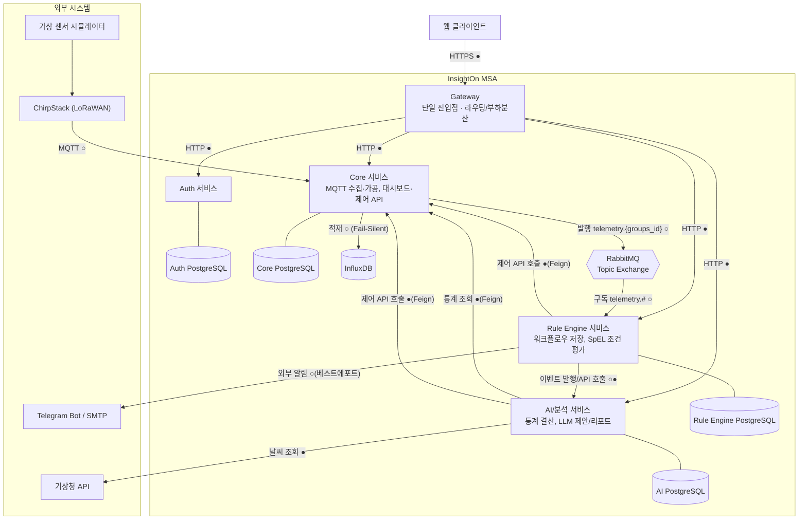
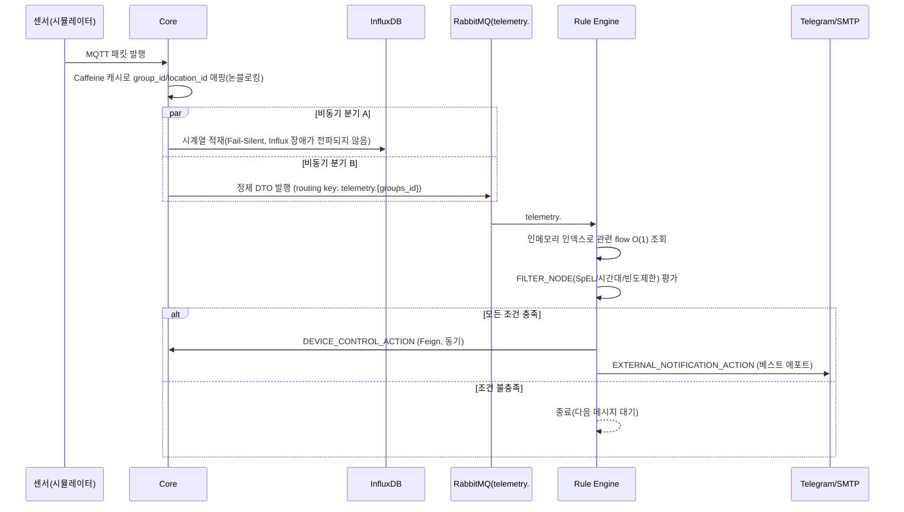
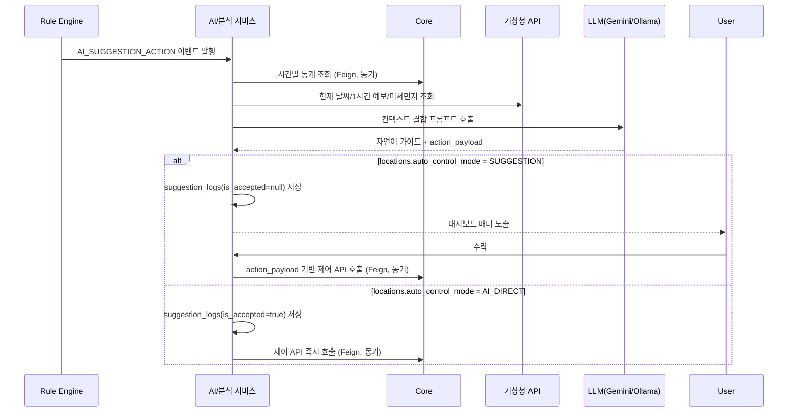
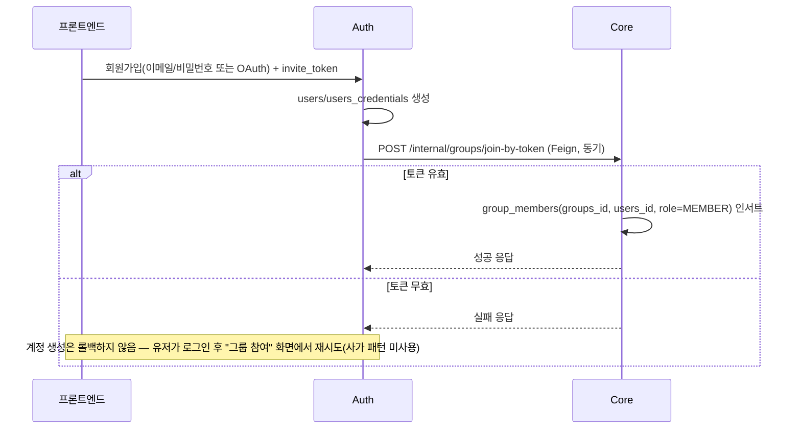

# InsightOn
### 멀티테넌트(SaaS) 스마트 오피스 지능형 IoT 관제 및 AI 자동 제어 플랫폼

실시간 IoT 관제 + 노코드 자동화 + LLM 기반 지능형 제어로, 
사람이 개입하지 않아도 오피스 공기질과 에너지가 최적 상태로 유지되는 플랫폼입니다.

 

## 📌 소개

**InsightOn**은 오피스 공간에 설치된 IoT 센서·액추에이터 데이터를 실시간으로 수집·관제하고, 규칙 기반 자동화와 AI 기반 지능형 판단을 결합해 실내 환경을 자동으로 최적화하는 멀티테넌트 SaaS 플랫폼입니다. 여러 고객사(그룹)가 하나의 플랫폼에서 완전히 격리된 환경으로 운영되며, MSA(Gateway / Auth / Core / Rule Engine / AI·분석) 구조로 설계되었습니다.
 

## 👥 팀원 소개

| 프로필 | GitHub | 이름 | 담당 파트 |
|:---:|:---|:---|:---|
|  | [@dayea11](https://github.com/dayea11) | | |
|  | [@hiadela0802](https://github.com/hiadela0802) | | |
|  | [@Jungeunsun565](https://github.com/Jungeunsun565) | | |
|  | [@naeun912](https://github.com/naeun912) | | |
|  | [@OiJs](https://github.com/OiJs) | | |
|  | [@SRIOUSS](https://github.com/SRIOUSS) | | |
|  | [@Wjdwodud2525](https://github.com/Wjdwodud2525) | | |
|  | [@wognlrla](https://github.com/wognlrla) | | |
 

## 📋 서비스 기획서

<b>펼쳐서 전체 기획서 보기</b>

 

1. 서비스 목적

 

**배경 및 문제의식**

오피스 공간의 공기질(CO2, 온도, 습도)과 공조 설비는 대부분 사람이 감각적으로 판단해 수동으로 조작하거나, 아예 관리되지 않은 채 방치됩니다.

- 실내 공기질이 나빠져도 즉시 인지하기 어렵고, 대응이 항상 늦습니다.
- 에어컨·공기청정기를 계속 켜두거나 반대로 꺼둔 채 방치해 에너지가 낭비됩니다.
- 환기를 해야 할지 공기청정기를 틀어야 할지 판단하려면 실내 상태뿐 아니라 바깥 날씨·미세먼지까지 종합적으로 봐야 하는데, 사람이 매번 확인하고 판단하기 어렵습니다.
- 여러 사업장(층/회의실 등)을 운영하는 회사는 공간마다 담당자가 따로 없어 관리 사각지대가 생깁니다.

**서비스 목표**

InsightOn은 오피스 공간에 설치된 IoT 센서·액추에이터를 실시간으로 관제하고, 규칙 기반 자동화와 LLM 기반 지능형 판단을 결합해 사람이 개입하지 않아도 실내 환경이 최적 상태로 유지되도록 만드는 멀티테넌트 SaaS 플랫폼입니다.

**타겟 고객**

여러 사무 공간(층, 회의실)을 운영하며 공기질·에너지 관리를 체계화하고 싶은 B2B 고객사(중소~중견 규모 오피스 운영 기업, 공유오피스 운영사 등).

**핵심 가치 제안**

- **실시간성**: 센서 패킷 인입부터 화면 반영까지 초저지연 처리
- **자동화의 2단계 구조**: 사람이 정한 명시적 규칙(규칙 기반 자동화)과, 상황을 스스로 해석해 선제적으로 판단하는 AI 자동 제어를 모두 제공
- **맥락 있는 판단**: 실내 데이터뿐 아니라 실시간 날씨·미세먼지까지 결합해 "왜 이 조치가 필요한지"를 자연어로 설명
- **멀티테넌트 격리**: 고객사별 데이터와 인프라가 완전히 분리되어 한 회사의 장애·트래픽 폭증이 다른 회사에 영향을 주지 않음

2. 요구사항 (전체 명세)

 

>  **Should**(MVP 포함, 지연 가능) / **Could**(여유 있으면 포함). `TBD`는 임의로 확정하지 않은 값입니다.

#### 2.1 실시간 관제 (담당: CORE)

| ID | 요구사항 | 상세 설명 / 수용 기준 | 우선순위 | 의존성 |
|---|---|---|---|---|
| FR-01 | 공간별 센서 실시간 차트 | CO2/온도/습도 각각 개별 차트로 표시. 신규 패킷 수신 후 화면 반영까지 지연 시간 `TBD`(NFR-01과 연동) 이내. 차트 축은 최근 `TBD`분/시간 슬라이딩 윈도우 | Must | Core MQTT 수집 파이프라인, InfluxDB 조회 API |
| FR-02 | 대시보드 위젯 커스터마이징 | 위젯 추가/삭제/드래그 배치/크기 조정이 가능하고 새로고침 후에도 배치가 유지(영속화)되어야 함. 위젯 종류: 시계열 차트, 현재값 카드, 기기 상태, 알람 피드(최소 세트, 확장 가능) | Should | `dashboards`/`widgets` 엔티티 |
| FR-03 | 기기 제어(수동) | 대시보드에서 액추에이터 ON/OFF 및 모드 제어. 명령 전송 후 `simulator_run_logs`에 실행 주체 `USER`로 기록되고, 실제 상태 반영을 대시보드에서 확인 가능해야 함 | Must | Core 제어 API, `device_attributes.current_value_str` |

#### 2.2 인프라/기기 관리 (담당: INFRA/CORE)

| ID | 요구사항 | 상세 설명 / 수용 기준 | 우선순위 | 의존성 |
|---|---|---|---|---|
| FR-04 | 게이트웨이/기기 상태 조회 | `gateways.status`(NORMAL/FAULT), `last_heartbeat_at` 기준 목록 조회. 하트비트 임계 시간(`TBD`, 예: 5분) 초과 시 FAULT 자동 전환 | Must | 게이트웨이 헬스체크 스케줄러(ShedLock) |
| FR-05 | 신규 기기 자동 인식 | 미등록 기기의 첫 패킷 수신 시 `devices`/`device_attributes` 자동 생성, 이후 즉시 대시보드에 노출 | Should | Core Auto-Provisioning 로직 |

#### 2.3 규칙 기반 자동화 (담당: ENGINE)

| ID | 요구사항 | 상세 설명 / 수용 기준 | 우선순위 | 의존성 |
|---|---|---|---|---|
| FR-06 | 노코드 플로우 빌더 | 트리거 1개 → 필터 0개 이상(직렬 체이닝=AND) → 액션 1개 이상(병렬 가능)을 드래그앤드롭으로 구성. 저장 시 `flows`/`nodes`/`links`로 영속화, `is_active` 토글로 즉시 활성/비활성 | Must | Rule Engine 엔티티 계층 |
| FR-07 | 센서 임계치 트리거 | `SENSOR_TRIGGER` — 특정 공간(선택적으로 특정 기기/메트릭)의 텔레메트리 도착 시 발화. RabbitMQ `telemetry.#` 소비 후 인메모리 인덱스로 O(1) 조회 | Must | Core→RabbitMQ 발행 파이프라인 |
| FR-08 | 스케줄 트리거 | `SCHEDULE_TRIGGER` — cron 표현식 기반 실행(예: 출근 시간 예열). 텔레메트리 이벤트 없이도 다운스트림 실행 | Should | Rule Engine 자체 스케줄러 |
| FR-09 | 조건 필터 | `THRESHOLD_FILTER`(SpEL 조건식), `TIME_WINDOW_FILTER`(시간대 제한) | Must | SpEL 평가기 |
| FR-10 | 반복 제어/알림 빈도 제한 | `TIMER_FILTER` — 지정 주기(`interval_seconds`)당 최초 1회만 통과, 그 사이 도착 메시지는 드롭(몰아서 처리 안 함). 상태는 `(node_uuid, locations_id/devices_id)` 조합별 독립, 인메모리(재시작 시 초기화는 의도된 동작) | Should | 단일 인스턴스 전제 — **다중 인스턴스 확장 시 Redis 공유 상태로 이전 필요(현재 스코프 아님)** |
| FR-11 | 규칙 기반 기기 제어 | `DEVICE_CONTROL_ACTION` — AI 개입 없이 Core 제어 API 직접 호출. `simulator_run_logs.executed_by_type='RULE_ENGINE'`로 기록 | Must | Core 제어 API |
| FR-12 | 즉시 알림 | `ALERT_ACTION` — LLM 없이 즉시 `dashboard_alerts` 생성 | Must | AI 서비스 알람 생성 API |
| FR-13 | AI 위임 | `AI_SUGGESTION_ACTION` — 실행 컨텍스트를 AI 서비스로 이벤트 발행 | Must | AI 서비스 이벤트 리스너 |
| FR-14 | 외부 채널 알림 | `EXTERNAL_NOTIFICATION_ACTION` — Telegram/이메일. 발송은 베스트 에포트(실패 시 재시도/영구 기록 없음, 확정 사항) | Should | Telegram Bot API / SMTP 연동 |

#### 2.4 AI 지능형 제어 (담당: CORE, AI, API)

| ID | 요구사항 | 상세 설명 / 수용 기준 | 우선순위 | 의존성 |
|---|---|---|---|---|
| FR-15 | 공간별 운영 모드 선택 | `locations.auto_control_mode` = `SUGGESTION` \| `AI_DIRECT` 토글 | Must | Core `locations` 스키마 보정 |
| FR-16 | 상황 인지형 제안 생성 | Core 시간별 통계 + 기상청 현재/1시간 예보/미세먼지를 결합해 LLM이 인과관계 있는 자연어 가이드 생성 | Must | 프롬프트 조립기, 기상청 캐시 |
| FR-17 | SUGGESTION 모드 수락 흐름 | 제안 생성 시 `is_accepted=null` 저장 + 대시보드 배너 노출 → 유저 수락 클릭 시 `action_payload` 기반 Core 제어 API 호출 및 `is_accepted=true` 갱신 | Must | `suggestion_logs` |
| FR-18 | AI_DIRECT 모드 즉시 집행 | 생성과 동시에 `is_accepted=true` 자동 적재 + 유저 확인 없이 즉시 Core 제어 API 호출 | Must | 동일 |

#### 2.5 알림 (담당: CORE, ENGINE)

| ID | 요구사항 | 상세 설명 / 수용 기준 | 우선순위 | 의존성 |
|---|---|---|---|---|
| FR-19 | 대시보드 실시간 알람 표시 | 신규 `dashboard_alerts` 생성 시 대시보드에 즉시 반영 | Must | **전송 방식(WebSocket/SSE/폴링) 미확정 — 팀 확인 필요** |
| FR-20 | Telegram/이메일 알림 | FR-14와 동일 채널 — 알람 발생 시 외부 채널로도 발송 | Could | FR-14 |

#### 2.6 리포트 (담당: AI — README 원본의 "CORE" 표기는 오탈자로 판단, `smart-office-iot-architecture-spec.md` 4장 기준 정정)

| ID | 요구사항 | 상세 설명 / 수용 기준 | 우선순위 | 의존성 |
|---|---|---|---|---|
| FR-21 | 정각 통계 집계 | 매시 정각 InfluxDB 원시 데이터로 평균/최고/최저 산출 + 액추에이터별 가동 분(JSONB) 산출. 데이터 없는 location은 행 미생성(의도된 동작) | Must | `hourly_telemetry_stats` 데이터 계층 |
| FR-22 | 주간/월간 리포트 | `hourly_telemetry_stats` 결산 데이터를 컨텍스트로 LLM이 마크다운 리포트 본문 생성 | Should | `reports` 데이터 계층 |

#### 2.7 이력/감사 (담당: CORE)

| ID | 요구사항 | 상세 설명 / 수용 기준 | 우선순위 | 의존성 |
|---|---|---|---|---|
| FR-23 | 실행 주체별 제어 이력 조회 | `executed_by_type`(`USER`/`AI_SYSTEM`/`RULE_ENGINE`) 기준 필터 조회 | Should | `simulator_run_logs` 스키마 보정 |

#### 2.8 조직/계정 관리 (담당: AUTH)

| ID | 요구사항 | 상세 설명 / 수용 기준 | 우선순위 | 의존성 |
|---|---|---|---|---|
| FR-24 | 회원가입/로그인 | 이메일+비밀번호 가입(BCrypt 해시, 이메일 소문자 정규화·중복 거부). 로그인 성공 시 Access·Refresh 발급, 실패 사유는 계정 열거 방지를 위해 통합 응답. 5회 연속 실패 시 5분 잠금 | Must | Auth `users`/`users_credentials` |
| FR-25 | 소셜 로그인/계정 연동 | OAuth(제공자 `TBD`). 미연결 수단인데 동일 이메일 계정이 존재하면 연동 여부 질의 → 동의 시 기존 비밀번호로 본인 확인 후 연결, 거부 시 가입 중단 및 기존 수단 안내(동일 이메일 복수 계정 생성 금지) | Must | Auth `oauth_accounts` |
| FR-26 | 토큰 발급·검증 | RS256 비대칭키 서명, Access `TBD`분/Refresh 14일, 권한 클레임 포함. Access=프론트 메모리, Refresh=httpOnly 쿠키+Redis. Gateway가 서명·만료·권한 검증 후 `X-User-Id`, `X-User-Role` 전달(매 요청 저장소 조회 없음) | Must | Redis, Gateway |
| FR-27 | 재발급·로그아웃 | Access 만료 시 Refresh 회전 재발급(Redis 조회는 재발급 시점에만), 폐기된 Refresh 재제출 시 해당 사용자 계열 전체 무효화. 로그아웃은 클라이언트 토큰 제거 + 서버 Refresh 폐기, Access는 front 폐기 | Must |  |
| FR-28 | 계정 관리 | 아이디 찾기(마스킹 표시), 비밀번호 찾기(일회성·만료 링크), 비밀번호 변경, 내 정보 조회·수정 및 연결 수단 관리(마지막 수단 해제 불가), 탈퇴(물리 삭제 대신 상태 전환·이력 보존). 비밀번호 변경·재설정·탈퇴 시 Refresh 폐기 | Must | 메일 발송, FR-04 |
| FR-29 | 역할 기반 접근 제어 | ADMIN/MEMBER 2단계, 가입 시 기본 MEMBER. 토큰 권한 클레임으로 인가 판단, 권한 부족 시 403. ADMIN이 구성원 목록 조회·역할 변경·블록 가능(다음 토큰 재발급 시 반영). 화면/API별 접근 권한 다름 | Must | Auth 권한 모델 |
| FR-30 | 장비 제어 인가 | 에어컨·공기청정기 등 장비 제어 API는 ADMIN만 호출 가능, MEMBER 요청은 403 반환. 민감 등급 제어에 대한 재인증(step-up) 적용 여부 `TBD` | Must | FR-06, Core 제어 API |
| FR-31 | 이력·보안 | 로그인/로그아웃/정보변경 시 IP·User-Agent 기록(3개월 초과 삭제, 토큰·비밀번호 원문 저장 금지). 인증 이벤트를 `login_success`/`login_failed`/`logout`/`token_refreshed`/`session_expired`로 구분 기록, 장비 제어는 감사 로그 별도. 휴면 전환은 스케줄러+Redis 분산 락 | Must | 로그 저장소, 스케줄러 |
#### 2.9 비기능 요구사항

| ID | 구분 | 요구사항 | 수용 기준 / 측정 방법 | 우선순위 |
|---|---|---|---|---|
| NFR-01 | 실시간성 | 패킷 수신~대시보드 반영 지연 | 목표 지연 시간 `TBD`(예: p95 2초 이내 제안, 팀 확인 필요) — 수집 스레드는 논블로킹 즉시 반환, 저장/전파는 비동기 분리 | Must |
| NFR-02 | 장애 격리 | InfluxDB 장애가 실시간 수집을 막지 않음 | Fail-Silent 구조 — Influx 쓰기 실패가 MQTT 리스너/RabbitMQ 발행 경로에 예외 전파되지 않음을 통합 테스트로 검증 | Must |
| NFR-03 | 멀티테넌시 | 그룹 간 데이터 물리적 격리 | 서비스별 독립 DB, 그룹 A의 쿼리가 그룹 B 데이터에 도달 불가함을 테스트로 검증 | Must |
| NFR-04 | 확장성 | 신규 센서/액추에이터 종류 추가 시 스키마 변경 불필요 | JSONB 컬럼 사용, 신규 종류 추가가 배포 없이 가능한지 확인 | Should |
| NFR-05 | 확장성 | 멀티 인스턴스 환경에서 배치 중복 실행 방지 | 정각 통계/주간·월간 리포트/기상청 캐시 갱신 배치에 ShedLock 적용, 2개 이상 인스턴스 동시 기동 시 1회만 실행되는지 검증 | Must |
| NFR-06 | 비용 효율 | LLM 호출은 이상 상황 발생 시에만 트리거 | 정기 배치성 LLM 호출 없음(리포트 배치 제외) | Should |
| NFR-07 | 성능 | 반복 조회 매핑 정보 캐싱 | Core `group_id`/`location_id`, Rule Engine `locations_id→flows` 매핑에 인메모리 캐시(Caffeine 등) 적용 | Should |
| NFR-08 | 보안 | 유출된 초대 토큰 즉시 무효화 | 재발급 즉시 이전 토큰으로 가입 시도 시 실패 응답 확인 | Must |
| NFR-09 | 데이터 무결성 | 동일 물리 DB 내 실제 FK 제약 | 각 서비스 ERD 갭 표 반영한 DDL에 FK 제약이 실제로 걸려 있는지 확인 | Must |
| NFR-10 | 오버 엔지니어링 회피 | 불필요한 이력 저장/과도한 트랜잭션 보장 지양 | 게이트웨이/기기 상태 이력 테이블 미생성, 알림 발송 로그 미보관 등 확정 사항 유지 | Should |

#### 2.10 미확정 항목 (임의 결정 금지 — 팀 논의 필요)

| 항목 | 관련 요구사항 | 비고 |
|---|---|---|
| 실시간 알람 푸시 방식 (WebSocket/SSE/폴링) | FR-19 | Issue 05 |
| 실시간성 목표 지연 시간(SLA) | NFR-01 | 구체적 수치 미정 |
| 게이트웨이 하트비트 임계 시간 | FR-04 | 구체적 수치 미정 |
| OAuth 제공자 목록 | FR-26 | 구체적 목록 미정 |
| 역할별 접근 권한 매트릭스 | FR-25 | 화면/API 단위 매핑표 별도 필요 |

3. 제공 기능

 

- **실시간 관제 대시보드**: 공간별 커스텀 위젯 대시보드, 실시간 시계열 차트
- **인프라 및 기기 관리**: 게이트웨이/기기 등록·상태 조회, 신규 기기 자동 인식
- **액추에이터 원격 제어**: 대시보드에서 수동 ON/OFF 및 모드 제어
- **노코드 자동화(규칙 엔진)**: 트리거 → 조건 필터 → 액션 드래그앤드롭 플로우 빌더 (센서 임계치/스케줄 트리거, 조건식/시간대/빈도 제한 필터, 기기 제어·알림·AI 요청 액션)
- **AI 지능형 제어**: 공간별 운영 모드 선택, 날씨·미세먼지 결합 상황 인지형 제안, 인과관계가 담긴 자연어 가이드
- **알림**: 대시보드 실시간 알람 피드, Telegram/이메일 외부 알림
- **리포트 및 분석**: 시간별 통계 집계, 주간/월간 AI 정밀 진단 리포트
- **제어 이력 및 감사**: 실행 주체별(유저/AI/규칙엔진) 제어 이력 조회
- **조직 및 계정 관리**: 초대 토큰 온보딩, 역할 기반 권한, 이메일/소셜 로그인

 

## 🏗️ 시스템 아키텍처

> 1) 컨테이너 다이어그램(프로토콜/동기·비동기 명시) + (2) 핵심 흐름 3개의 시퀀스 다이어그램 + (3) 데이터 저장 전략

### 3.1 컨테이너 다이어그램

MSA(5개 마이크로서비스) 구조로, 서비스 간 물리 DB는 완전히 분리되고 논리 키 매핑으로 연동됩니다. 화살표에는 프로토콜과 동기(●)/비동기(○) 여부 표기

| 컴포넌트 | 책임 | 데이터 저장소 |
|---|---|---|
| Gateway | 단일 진입점, 라우팅/부하분산 | - |
| Auth | 인증/인가 | 독립 PostgreSQL |
| Core | MQTT 수집·가공, 인프라 장부, 대시보드 API, 액추에이터 제어 | Core PostgreSQL + InfluxDB |
| Rule Engine | 워크플로우 저장, 실시간 SpEL 조건 평가 | 독립 PostgreSQL |
| AI/분석 | 정각 통계 결산, 실시간 제어 제안, LLM 리포트 | 독립 PostgreSQL |

**연동 원칙**: 서비스 간 물리 DB는 완전히 분리(Database-per-Service)되며, 물리 FK 대신 애플리케이션 레이어의 논리 키 매핑으로 연동한다. 동일 서비스 내부(같은 물리 DB) 테이블 간에는 실제 FK 제약을 건다. 서비스 간 동기 호출은 OpenFeign, 비동기 전파는 RabbitMQ만 사용한다.

### 3.2 핵심 흐름 ① — 실시간 센서 수집 → 규칙 기반 자동화

### 3.3 핵심 흐름 ② — AI 제안 / AI 직접 제어

### 3.4 핵심 흐름 ③ — 초대 토큰 온보딩 (Auth ↔ Core 크로스 서비스)

### 3.5 데이터 저장 전략

| 저장소 | 대상 | 이유 |
|---|---|---|
| PostgreSQL (서비스별 독립) | 마스터 데이터, 설정, 로그성 데이터(임계 이력 아님) | 트랜잭션/정합성 필요, Database-per-Service로 장애·트래픽 격리 |
| InfluxDB | 센서 원시 시계열, 액추에이터 상태 시계열 | 고빈도 쓰기·시간 범위 쿼리에 특화, RDB에 적재 시 트래픽 폭증 시 병목 |
| Caffeine(인메모리 캐시) | `group_id`/`location_id` 매핑, Rule Engine flow 인덱스 | 반복 조회 병목 제거, 서비스 재시작 시 재구성되는 휘발성 캐시로 충분 |
| ShedLock | 정각 통계 배치, 주간/월간 리포트 배치, 기상청 캐시 갱신 배치 | 멀티 인스턴스(Eureka) 환경에서 동일 배치 중복 실행 방지 |

 

 

## 🛠️ 기술 스택

`Java` · `Spring Boot` · `Spring AI` · `Thymeleaf` · `PostgreSQL` · `InfluxDB` · `RabbitMQ` · `ChirpStack (LoRaWAN)` · `MQTT`
